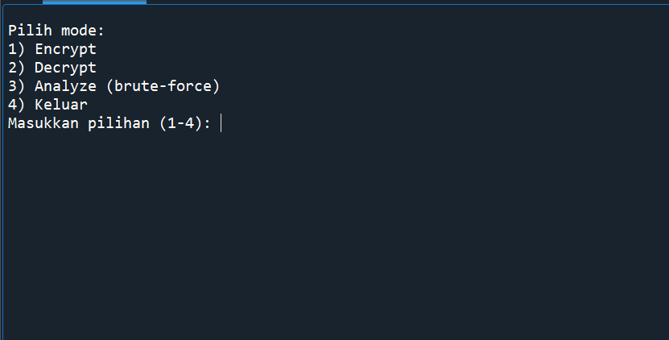

# Ceasar-Cipher-2
# 🔐 Caesar Cipher — encrypt / decrypt / analyze (hybrid CLI + interaktif)

Program Python sederhana untuk:

* **encrypt** → enkripsi teks (kunci 1–25)
* **decrypt** → dekripsi teks (kunci 1–25)
* **analyze** → brute-force (26 kemungkinan) + analisis frekuensi untuk menebak plaintext terbaik

Program ini bersifat **hybrid**:

* Bila dijalankan dengan argumen → berfungsi sebagai CLI.
* Bila dijalankan tanpa argumen → masuk ke **mode interaktif** (menu).

---

## Fitur

* Menjaga huruf besar/kecil (case-preserving).
* Mengabaikan karakter non-alfabet (angka, spasi, simbol tidak diubah).
* Mode `analyze` menampilkan semua kandidat (atau top N) dan menebak plaintext terbaik dengan:

  * **Chi-squared** terhadap frekuensi huruf bahasa Inggris.
  * Heuristik **ETAOIN SHRDLU** (huruf-huruf umum dalam bahasa Inggris).
  * Gabungan skor untuk menentukan kandidat terbaik.

---

## Persyaratan

* Python 3.6+ (direkomendasikan Python 3.8 atau lebih baru)

---

## Instalasi / Persiapan

1. Clone repository:

```bash
git clone https://github.com/username/caesar-cipher.git
cd caesar-cipher
```

2. Pastikan file `caesar_cipher.py` executable (opsional):

```bash
chmod +x caesar_cipher.py
```

3. Jalankan dengan Python:

```bash
python caesar_cipher.py
```

atau (jika executable):

```bash
./caesar_cipher.py
```

---

## Cara Penggunaan

### A. Mode Interaktif (direkomendasikan untuk pemula)

Jalankan tanpa argumen:

```bash
python caesar_cipher.py
```

Menu interaktif akan muncul:

1) Encrypt (pilih 1)
Prompt:
Masukkan plaintext: → ketik teks yang ingin dienkripsi (boleh mengandung spasi dan simbol).
Masukkan kunci (1-25): → masukkan angka integer antara 1 dan 25.
Validasi:
Jika kunci bukan angka atau tidak dalam 1–25 → tampilkan pesan error dan minta ulang.
Output contoh:
Masukkan plaintext: Halo Dunia 123!
Masukkan kunci (1-25): 3

Hasil (encrypt):
Kdor Gxqld 123!

2) Decrypt (pilih 2)
Prompt:
Masukkan ciphertext: → ketik ciphertext yang akan didekripsi.
Masukkan kunci (1-25): → masukkan angka integer antara 1 dan 25.
Output contoh:
Masukkan ciphertext: Kdor Gxqld 123!
Masukkan kunci (1-25): 3

Hasil (decrypt):
Halo Dunia 123!

3) Analyze (pilih 3)
Prompt:
Masukkan ciphertext untuk dianalisis: → masukkan ciphertext tanpa kunci.
Tampilkan top N kandidat (enter = 10): → tekan Enter atau masukkan angka N (mis. 5).
Tampilkan semua kandidat? (y/N): → ketik y untuk menampilkan semua 26 shift, atau N/Enter untuk hanya menampilkan top N.
Output: program menampilkan daftar kandidat yang diurutkan menurut skor (lebih tinggi dianggap lebih mirip bahasa Inggris), lalu menampilkan tebakan terbaik.
Contoh:
Masukkan ciphertext untuk dianalisis: Kdor Gxqld 123!
Tampilkan top N kandidat (enter = 10):
Tampilkan semua kandidat? (y/N):

[rank  1] key= 3  score= -12.345  -> Halo Dunia 123!
[rank  2] key=23  score= -30.111  -> Exjk Arkgx 123!
...
=== Best guess ===
Key (encryption shift) = 3
Plaintext candidate      = Halo Dunia 123!

4) Keluar (pilih 4)
Program akan berhenti.
